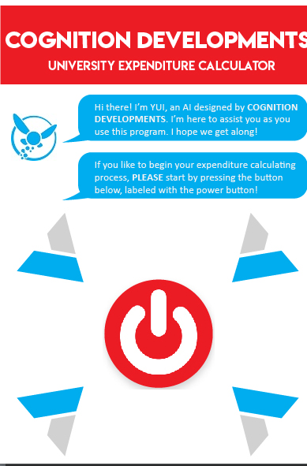
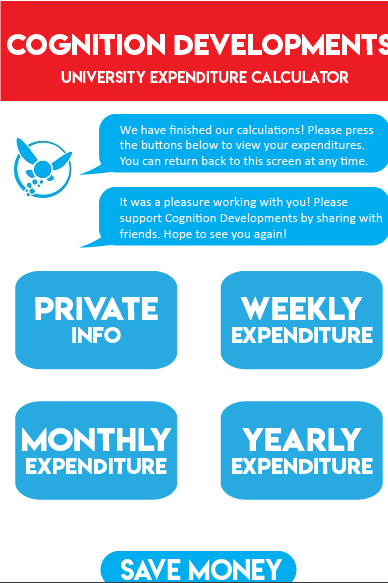

# Student-Expenditure-Calculator
A student expenditure application that allows students to calculate the summation of their expenses for university.

___

**Note:** Executing the code in IntelliJ results in a weird bug where the graphics do not update when ran regularly. To resolve this, set a breakpoint anywhere in the program and run in debug mode OR run in coverage mode.
